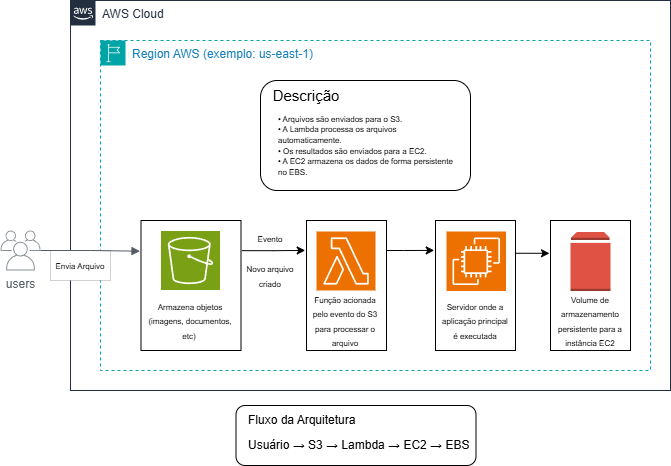

# 🖥️ Computação na AWS com Amazon EC2

## Sobre este módulo

Neste módulo comecei a entender como a AWS oferece capacidade computacional na nuvem através do Amazon EC2.

Foi interessante perceber que uma instância EC2 funciona de forma muito parecida com um servidor tradicional, mas com a vantagem de poder ser criada, modificada ou removida em poucos minutos.

Além do EC2, também estudei conceitos relacionados a armazenamento, escalabilidade, alta disponibilidade e otimização de custos, que são fundamentais para construir aplicações resilientes na nuvem.

Aqui estão registradas minhas anotações, atividades práticas e os principais aprendizados desta etapa.

---

## O que aprendi

* O que é o Amazon EC2
* Tipos de instâncias
* Modelos de compra
* Amazon EBS
* Elastic Load Balancer (ELB)
* Auto Scaling
* Monitoramento com CloudWatch
* Alta disponibilidade
* Escalabilidade vertical e horizontal

---

## Principais conclusões

O Amazon EC2 é um dos serviços mais importantes da AWS e serve como base para diversos cenários de hospedagem de aplicações.

Também ficou claro como serviços como Auto Scaling e Elastic Load Balancer ajudam a construir aplicações mais resilientes e preparadas para lidar com variações de tráfego.

Outro ponto importante foi compreender as diferenças entre os modelos de compra de instâncias, especialmente On-Demand, Reserved e Spot, que costumam aparecer bastante em simulados e certificações.

---

# 🚀 Desafio Prático

Como atividade prática deste módulo, desenvolvi uma arquitetura simples utilizando serviços da AWS para representar um fluxo de processamento e armazenamento de dados.

O objetivo foi aplicar os conceitos estudados e praticar a documentação de soluções em nuvem.

---

## Serviços Utilizados

### Amazon S3

Serviço de armazenamento de objetos utilizado para receber arquivos enviados pelos usuários.

### AWS Lambda

Serviço serverless responsável por executar o processamento automático dos arquivos recebidos.

### Amazon EC2

Instância responsável pela execução da aplicação principal.

### Amazon EBS

Volume de armazenamento persistente conectado à instância EC2.

---

## Fluxo da Arquitetura

1. O usuário envia arquivos para um bucket Amazon S3.
2. Um evento criado no bucket aciona uma função AWS Lambda.
3. A função Lambda processa o arquivo recebido.
4. Os dados processados são enviados para uma instância Amazon EC2.
5. A instância EC2 utiliza um volume Amazon EBS para armazenamento persistente.

### Fluxo resumido

```text
Usuário → S3 → Lambda → EC2 → EBS
```

---

## Diagrama da Arquitetura


Abaixo está o diagrama desenvolvido durante o desafio.



---

## Aprendizados Obtidos

Durante este desafio pude visualizar na prática como diferentes serviços da AWS podem trabalhar juntos dentro de uma arquitetura.

Além de reforçar os conceitos de computação em nuvem, a atividade também me ajudou a compreender melhor a integração entre serviços de armazenamento, processamento e computação.

Outro aprendizado importante foi a utilização do GitHub como ferramenta para documentar projetos e organizar estudos de forma mais profissional.

---

## Arquivos deste módulo

* `README.md` → Documentação do módulo e do desafio desenvolvido.
* `anotacoes.md` → Resumo dos conceitos estudados sobre Amazon EC2 e computação na AWS.
* `images/arquitetura-s3-lambda-ec2-ebs.png` → Imagem da arquitetura desenvolvida durante o desafio.
* `diagrams/arquitetura-s3-lambda-ec2-ebs.drawio` → Arquivo-fonte editável do diagrama criado no Draw.io.

---

## Estrutura do Projeto

```text
02-computacao-ec2
│
├── README.md
├── anotacoes.md
│
├── diagrams
│   └── arquitetura-s3-lambda-ec2-ebs.drawio
│
└── images
    └── arquitetura-s3-lambda-ec2-ebs.png
```

## Observação

O diagrama foi desenvolvido utilizando o Draw.io. O arquivo `.drawio` foi disponibilizado junto ao projeto para permitir futuras alterações e facilitar o reaproveitamento da arquitetura em outros estudos e projetos.
